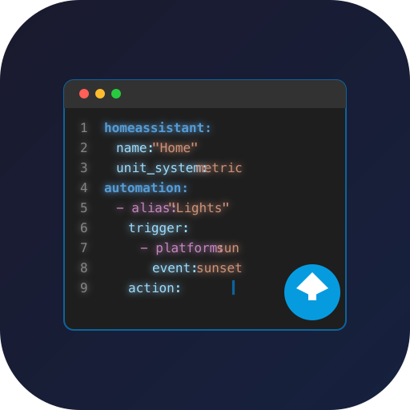

#  Home Assistant Configuration Editor

[](https://github.com/roman-pinchuk/conf-edit-ha/releases)
[](https://github.com/roman-pinchuk/conf-edit-ha/actions/workflows/builder.yaml)
[](https://github.com/roman-pinchuk/conf-edit-ha/security/code-scanning)
[](https://github.com/roman-pinchuk/conf-edit-ha/security/dependabot)
[](https://github.com/roman-pinchuk/conf-edit-ha/commits/main)
[](LICENSE.md)
[](https://www.python.org/)
[](https://developers.home-assistant.io/docs/apps/presentation/#ingress)


A lightweight Home Assistant add-on that provides a simple text editor for configuration files with YAML syntax highlighting, entity autocomplete, and Home Assistant config validation after saving.

## Features

- **Lightweight CodeMirror 6 editor** (~1MB, 10x smaller than Monaco)
- **Real-time client validation**: Blocks saving if there are YAML syntax errors or invalid entity IDs
- **One-click "Restore Valid State"** to quickly undo broken configuration edits
- **Home Assistant config validation** after save using the same config check API as Developer Tools
- **Entity autocomplete** (substring matching from live HA API)
- **VS Code-style file tree** with expand/collapse and indentation guides
- **Rainbow indentation** for YAML structure visualization
- **Dark/light theme** with automatic system preference detection
- **State persistence** - remembers last opened file
- **Tree browser** with folder navigation
- **Auto-backup** on every save (creates `.backup` files)
- **Multi-architecture support** (amd64, aarch64, armv7, armhf, i386)
- **Ingress support** - runs securely within Home Assistant

## Installation

### Quick Install

Click the button below to add this repository to your Home Assistant:

[](https://my.home-assistant.io/redirect/supervisor_add_addon_repository/?repository_url=https%3A%2F%2Fgithub.com%2Froman-pinchuk%2Fconf-edit-ha)

### Manual Installation

1. In Home Assistant, go to **Settings → Add-ons → Add-on Store**
2. Click the **three dots menu** (top right) → **Repositories**
3. Add this repository URL: `https://github.com/roman-pinchuk/conf-edit-ha`
4. Find "Configuration Editor" in the add-on store and click **Install**
5. Start the add-on
6. Access via the sidebar panel "Config Editor"

## Configuration

```yaml
theme: auto  # Options: auto, light, dark
```

- `theme`: Set to `auto` to follow system theme, or manually select `light`/`dark`

## Usage

1. Open the add-on from the Home Assistant sidebar
2. Select a YAML file from the file browser
3. Edit the file with syntax highlighting
4. Type to get entity autocomplete suggestions
5. Real-time validation will instantly warn you of YAML syntax errors or unknown entity IDs and block saving. You can click **Restore Valid State** to easily undo them.
6. Click "Save" to save changes (creates automatic backup)
7. Review the Home Assistant validation result in the status bar
8. If backend validation fails, click or tap the status bar to expand the full error details

## Tech Stack

- Backend: Python + Flask
- Frontend: TypeScript + CodeMirror 6 + Vite
- Container: ~50MB total size
  


## Security

- All file operations are restricted to `/config` directory
- Automatic backups created before each save
- No external dependencies or internet access required

## Development

### Quick Start

```bash
# Build everything and run
make build run

# Or step by step:
make build-frontend  # Build frontend
make build-docker    # Build Docker image
make run            # Start container

# View logs
make logs

# Restart after changes
make restart
```

### Building for Multiple Architectures

The add-on automatically builds for all supported architectures when published to Home Assistant. For local multi-arch testing:

```bash
make build-multiarch
```

See [BUILD.md](BUILD.md) for detailed build instructions.

### Project Structure

```
conf-edit-ha/
├── app.py              # Flask backend
├── frontend/           # TypeScript + Vite frontend
│   ├── src/
│   │   ├── main.ts     # App entry point
│   │   ├── editor.ts   # CodeMirror setup
│   │   ├── api.ts      # API client
│   │   └── theme.ts    # Theme management
│   └── styles.css      # VS Code-style CSS
├── static/             # Built frontend (generated)
├── config.yaml         # Add-on configuration
├── build.yaml          # Multi-arch build config
└── Dockerfile          # Container definition
```

## Support

For issues and feature requests, visit: [GitHub Issues](https://github.com/roman-pinchuk/conf-edit-ha/issues)

## License

This project is licensed under the [MIT License](LICENSE.md).
